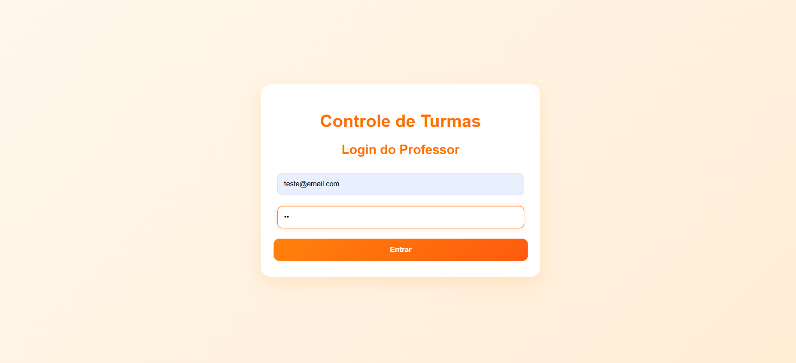
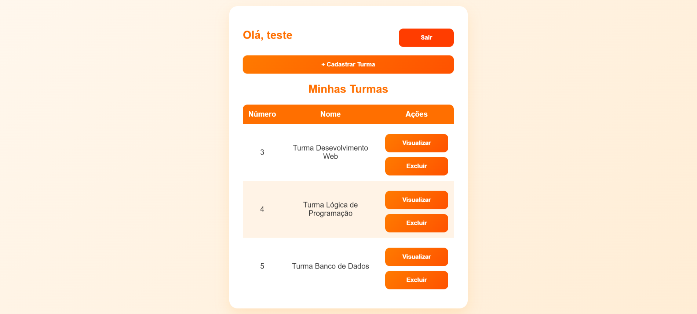
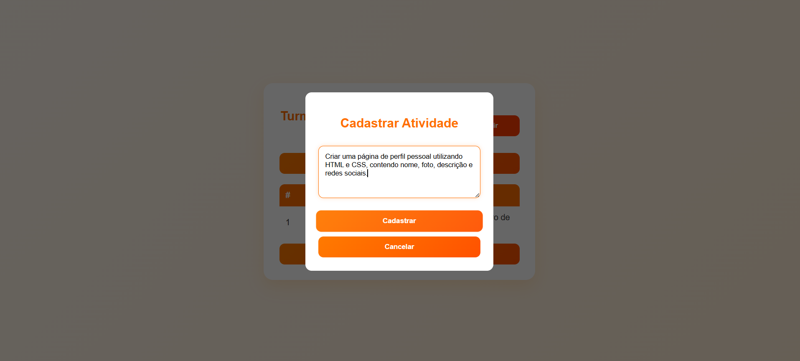
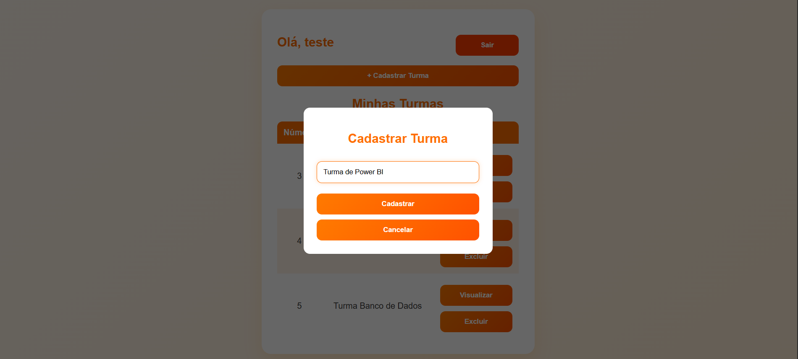
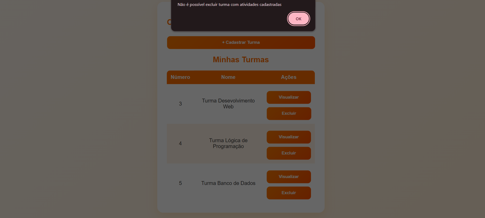
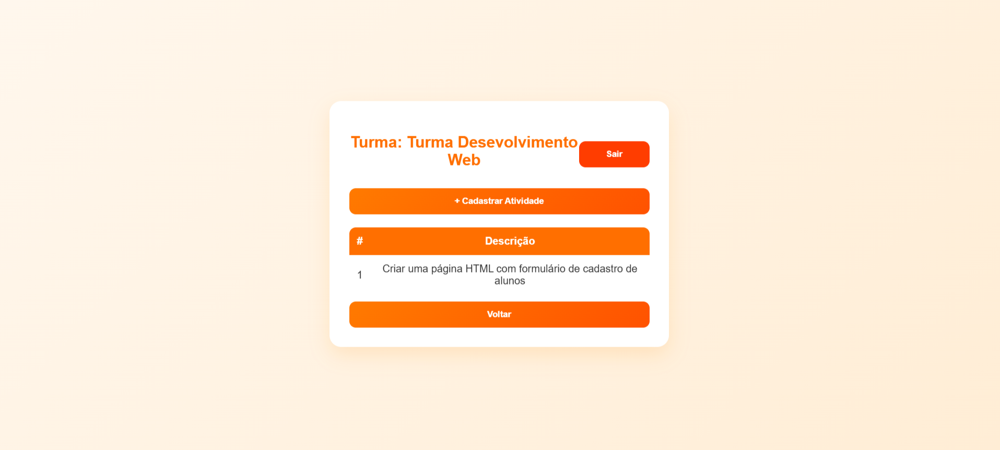
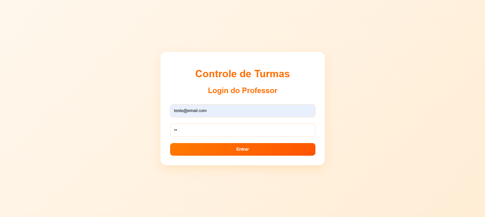

#  Sistema de Controle de Turmas e Atividades

Sistema web para gerenciamento de turmas e atividades de professores, com autenticação e controle de registros.

---

## Funcionalidades

- Login de professor
- Painel principal do professor
- Cadastro de turmas
- Listagem de turmas
- Exclusão de turmas com validação
- Cadastro e listagem de atividades por turma
- Logout do sistema

---

##  Tecnologias utilizadas

- HTML
- CSS
- JavaScript
- API REST

---

## Prints do sistema

-  Tela de login  
  

-  Painel principal do professor (com listagem de turmas)  
  

-  Cadastro de atividade  
  

-  Cadastro de turma  
  

-  Exclusão de turma (alerta ou confirmação)  
  

-  Tela de atividades da turma  
  

 -  Logout do sistema (retorno ao login)  
  

---

##  Como executar o projeto

1. Iniciar o backend (API)
2. Abrir o arquivo `index.html`
3. Fazer login e usar o sistema